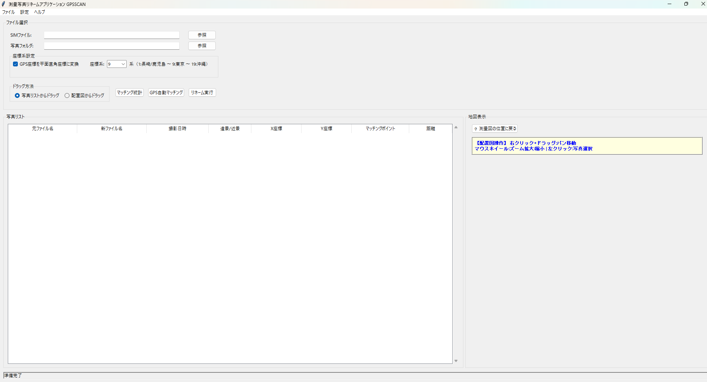
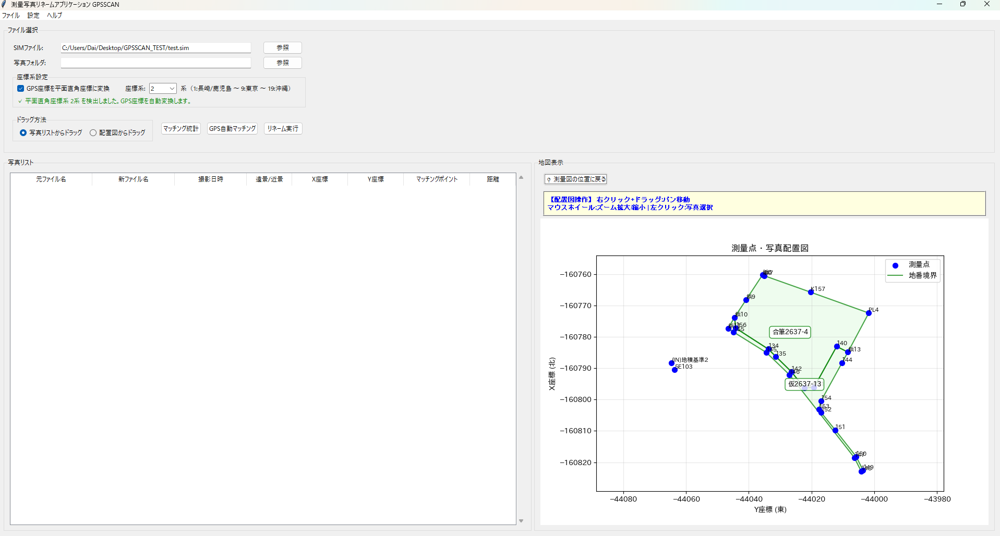
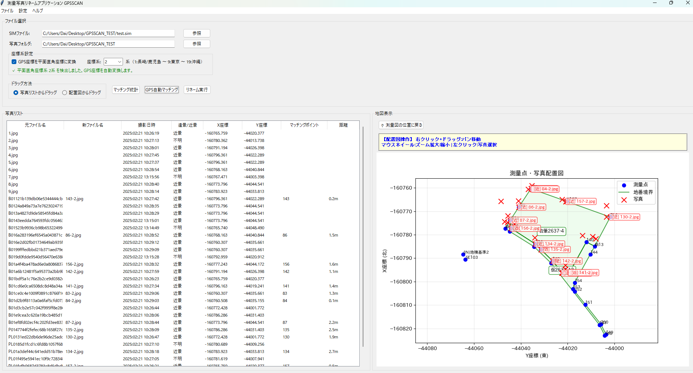

# GPSSCAN - 測量写真リネーム自動化アプリケーション

[](https://www.python.org/downloads/)
[](LICENSE)

**8年間の測量業務経験から生まれた、写真管理業務を数時間→数分に短縮する自動化ツール**


---

## 🎯 解決した課題

測量業務において、毎回以下の作業に数時間かかっていました：

### 従来の手作業
1. **GPS付き写真の整理** - 数百枚の写真を1枚ずつ確認
2. **測量点とのマッチング** - 写真がどの測量点かを目視判別
3. **ファイル名の手動変更** - 測量規則に従ったリネーム作業
4. **遠景・近景の分類** - 写真内容を見て判断・分類

**問題点**: 年間40〜80件の業務で、この作業だけで膨大な時間を消費

---

## ✅ 開発した解決策

GPS情報とSIM測量データを自動照合し、**ドラッグ&ドロップの直感操作**だけで写真を自動リネームするシステムを開発。

### 主な機能

| 機能 | 効果 |
|------|------|
| **📍 GPS座標の自動変換** | WGS84 → 平面直角座標系（1〜19系対応） |
| **🎯 ドラッグ&ドロップ操作** | 直感的な写真配置UI |
| **🗺️ 配置図の可視化** | matplotlib による地図表示 |
| **📷 遠景/近景の自動分類** | 視覚的な色分け表示 |
| **💾 自動ファイル名生成** | 測量規則に準拠した命名 |

---

## 📊 成果

| 項目 | 改善効果 |
|------|---------|
| **作業時間** | 数時間 → **数分** |
| **適用件数** | 年間40〜80件 |
| **エラー率** | 手作業の人的ミスを完全排除 |
| **業務効率** | 約**95%の時間削減** |

---

## 💡 開発プロセス

このプロジェクトは以下のアプローチで開発しました：

### 1. 実務経験からの課題抽出
- 8年間の測量業務で実際に直面した非効率な作業を分析
- 業務フロー全体を理解し、自動化すべきポイントを特定

### 2. 生成AI（Claude/ChatGPT）の活用
- 要件定義をもとに、生成AIを使って効率的にコード生成
- 座標変換・GUI実装などの技術的課題を解決

### 3. コードレビューと学習
- 生成されたコードを読解し、測量業務に合わせてカスタマイズ
- pyproj、matplotlibなどのライブラリの仕組みを理解

### 4. 技術書による理論補完
- オライリー「入門 Python 3」で基礎理論を学習
- 実装の裏付けとなる知識を体系的に習得

**現在も学習中**: 生成AIで作成したコードの仕組みを理解するため、継続的に技術書で学習しています。

---

## 🛠️ 技術スタック

```python
# 主要技術
Python 3.8+
├── GUI: tkinter
├── 座標変換: pyproj (平面直角座標系対応)
├── 可視化: matplotlib
├── データ処理: pandas
└── 画像処理: PIL, OpenCV
```

### 技術的な工夫

#### 1. 座標系の自動判定
```python
# GPS座標から平面直角座標系（1〜19系）を自動判定
# 測量標準（X=北、Y=東）に対応
```

#### 2. ドラッグ&ドロップUI
- 2つのドラッグモード実装
- リアルタイム地図更新
- パン・ズーム操作対応

#### 3. ファイル名の重複処理
```python
# 例: 既存写真がある場合の自動調整
既存: 境界01-2.jpg (近景)
追加: 境界01-2.jpg → 既存を 境界01_3.jpg に、新規が基本形に
```

---

## 🎨 システム画面

### メイン画面


### 地図表示


### 処理結果



---

## 🚀 クイックスタート

### インストール
```bash
git clone https://github.com/D1424-da/GPSSCAN.git
cd GPSSCAN
pip install -r requirements.txt
```

### 実行
```bash
python GPSSCAN.py
```

### 基本的な使い方
1. SIMファイル（測量データ）を読み込み
2. GPS付き写真フォルダを選択
3. 写真を地図上の測量点にドラッグ&ドロップ
4. 遠景/近景を選択
5. リネーム実行

---

## 📋 対応形式

- **SIMファイル**: A01/A02/D00形式
- **画像形式**: GPS情報付きJPG
- **座標系**: 平面直角座標系 1〜19系、任意座標系

---

## 🎯 今後の改善案

- [ ] より多くのSIM形式への対応
- [ ] 機械学習による遠景/近景の自動判別
- [ ] クラウド同期機能
- [ ] バッチ処理の高速化

---

## 📝 学習プロセス

このプロジェクトを通じて学んだこと：
- **座標変換の実装**: 測地系の理解とpyprojの活用
- **GUI設計**: tkinter + matplotlibの統合
- **実務課題への技術適用**: 業務知識とプログラミングの融合
- **生成AIの効果的な活用**: 要件定義の重要性

---

## 📄 ライセンス

MIT License

## 👤 作者

**池田大介 (Daisuke Ikeda)**
- GitHub: [@D1424-da](https://github.com/D1424-da)
- Email: d.i.a.0101@gmail.com

---

**⚡ 測量業務の効率化で、本質的な業務に集中できる時間を創出します**